<div align="center">

  

  # ChangeGuard

  ### Pre-Deployment Impact Intelligence for Distributed Systems
  **Know the blast radius before you deploy.**

  [](https://react.dev/)
  [](https://www.typescriptlang.org/)
  [](https://vitejs.dev/)
  [](https://tailwindcss.com/)
  [](https://reactflow.dev/)
  [](LICENSE)

  <p align="center">
    ChangeGuard is a static dependency analyzer and blast-radius simulator that inspects distributed software codebases, generates genuine multi-branch architecture graphs, and quantifies cascade risk before changes hit production.
  </p>

</div>

---

## 📋 Table of Contents

- [Overview](#-overview)
- [Key Features](#-key-features)
- [Architectural Layers](#-architectural-layers)
- [Core Workflow](#-core-workflow)
- [Tech Stack](#-tech-stack)
- [Project Structure](#-project-structure)
- [Getting Started](#-getting-started)
  - [Prerequisites](#prerequisites)
  - [Installation](#installation)
  - [Development Server](#development-server)
  - [Production Build](#production-build)
- [Verification & Sample Projects](#-verification--sample-projects)
- [Export Formats](#-export-formats)
- [Security & Privacy](#-security--privacy)
- [License](#-license)

---

## 🔍 Overview

Modern microservice and distributed architectures suffer from **hidden coupling and dependency drift**. A seemingly trivial change to a database column, shared internal client, or gateway endpoint can trigger catastrophic cascading failures across downstream domain services, background workers, and message buses.

**ChangeGuard** solves this by providing:
1. **Automated Codebase Extraction**: Ingests project archives (`.zip`), parses source files, manifests, and configurations directly in the browser.
2. **True Directed Graph Construction $G = (V, E)$**: Discards linear flow simplifications in favor of branching, merging, and tiered layer topologies.
3. **Upstream & Downstream Blast Radius Calculation**: Identifies every service directly modified, indirectly affected, or placed at critical risk.
4. **Actionable Verification & Test Plans**: Generates automated verification matrices, integration test scenarios, and rollback plans.

---

## ✨ Key Features

- **🌐 Deep Multi-Language Dependency Parsing**
  - Extracts imports, client bindings, API controllers, repositories, and database drivers across JavaScript/TypeScript, Python, and Java.
  - Inspects infrastructure configs: Docker Compose, Kubernetes manifests, and OpenAPI specifications.

- **📊 Multi-Branch & Multi-Layer Dependency Graph**
  - Renders true microservice topologies using `@xyflow/react` (React Flow).
  - Eliminates artificial linear daisy chains (`A -> B -> C -> D`).
  - Supports branching (one service calling multiple dependencies) and merging (multiple services converging on a single database or event bus).

- **🔎 Explainable Relationship Inspector**
  - Click on any edge in the graph to view **why** the dependency exists.
  - Displays source file location, evidence code snippet, and confidence score.
  - Semantic relationship types: `CALLS`, `USES_DATABASE`, `USES_EXTERNAL_API`, `PUBLISHES`, `CONSUMES`, `DEPENDS_ON`, and `IMPORTS`.

- **⚡ Interactive Change & Risk Simulation**
  - Select one or more target services to simulate code, schema, or configuration updates.
  - Real-time blast radius traversal reveals:
    - **Primary Impact**: Directly changed services.
    - **Secondary Ripple**: Downstream services consuming contracts or databases.
    - **Upstream Callers**: Ingress gateways and web frontends affected by contract shifts.
  - Automated risk scoring: `LOW`, `MEDIUM`, `HIGH`, `CRITICAL`.

- **📝 Automated Test Plan Generation**
  - Produces customized testing checklists: Unit, Integration, Smoke, and Regression tests.
  - Outlines concrete mitigation strategies and rollback procedures tailored to the detected risk profile.

- **📄 Enterprise Multi-Format Reporting**
  - **Executive PDF Report**: Multi-page styled verification document with risk summary tables, component breakdowns, and sign-off blocks (`jspdf` + `jspdf-autotable`).
  - **Structured JSON**: Machine-readable payload for CI/CD gating and automated quality checks.
  - **Pull Request Markdown**: Formatted summary ready to paste into GitHub/GitLab PR descriptions.

- **🔒 100% In-Browser Privacy**
  - Complete zero-backend architecture. All parsing, graph layout computation, and analysis happen on the client.
  - No source code or confidential credentials leave your local browser sandbox.

---

## 🏛️ Architectural Layers

ChangeGuard organizes detected components into 6 deterministic architectural tiers:

```
┌────────────────────────────────────────────────────────┐
│ Layer 1: APPLICATIONS (Web App, Mobile App)            │
└───────────────────────────┬────────────────────────────┘
                            │
┌───────────────────────────▼────────────────────────────┐
│ Layer 2: API / GATEWAY (Edge Gateway, Reverse Proxy)    │
└───────────────────────────┬────────────────────────────┘
                            │
┌───────────────────────────▼────────────────────────────┐
│ Layer 3: CORE SERVICES (Order, Payment, Inventory...)  │
└───────────────────────────┬────────────────────────────┘
                            │
┌───────────────────────────▼────────────────────────────┐
│ Layer 4: WORKERS / EVENTS (Consumers, Event Brokers)   │
└───────────────────────────┬────────────────────────────┘
                            │
┌───────────────────────────▼────────────────────────────┐
│ Layer 5: DATA / STORAGE (PostgreSQL, Redis, Warehouse) │
└───────────────────────────┬────────────────────────────┘
                            │
┌───────────────────────────▼────────────────────────────┐
│ Layer 6: EXTERNAL / INFRA (Stripe, Twilio, K8s, Docker)│
└────────────────────────────────────────────────────────┘
```

| Layer | Group Identifier | Typical Detected Components |
|---|---|---|
| **Layer 1** | `FRONTEND` | React/Next.js apps, Vue, Mobile clients, Single-Page Applications |
| **Layer 2** | `API / GATEWAY` | Express API Gateways, Spring Cloud Gateway, Nginx routers, GraphQL edge |
| **Layer 3** | `CORE SERVICES` | Domain microservices (Order, Payment, Inventory, Transfer, Ledger) |
| **Layer 4** | `WORKERS / EVENTS` | Queue consumers, Notification workers, Kafka / RabbitMQ event buses |
| **Layer 5** | `DATA` | Relational databases (PostgreSQL, MySQL), Caches (Redis), Warehouses |
| **Layer 6** | `EXTERNAL / INFRA` | External APIs (Stripe, Twilio, SendGrid), Docker Compose, Kubernetes |

---

## 🔄 Core Workflow

```mermaid
flowchart LR
    A[Upload Project ZIP] --> B[Client-Side Extraction]
    B --> C[AST & Manifest Scanner]
    C --> D[Graph Builder G = V, E]
    D --> E[Layer & Partition Layout]
    E --> F[Interactive Architecture Graph]
    F --> G[Simulate Change]
    G --> H[Blast Radius Engine]
    H --> I[Risk Matrix & Test Plan]
    I --> J[Export PDF / JSON / MD]
```



1. **Upload**: Drag and drop a project archive (`.zip`) or choose from built-in sample architectures.
2. **Analysis**: The scanner discovers services, entrypoints, database models, internal clients, and dependencies.
3. **Graph Exploration**: Inspect services, connections, evidence snippets, and partition groups.
4. **Change Simulation**: Configure a change scenario (e.g., modifying `payment-service` schema) to compute ripple propagation.
5. **Mitigation**: Review the generated verification plan, regression scope, and export executive documentation.

---

## 🛠️ Tech Stack

- **Core Framework**: [React 19](https://react.dev/) + [TypeScript](https://www.typescriptlang.org/)
- **Build Tool**: [Vite 8](https://vitejs.dev/) with React plugin
- **Styling**: [Tailwind CSS v4](https://tailwindcss.com/) + custom futuristic dark glassmorphism theme
- **Graph Visualization**: [@xyflow/react](https://reactflow.dev/) (React Flow v12)
- **Archive Parsing**: [JSZip](https://stuk.github.io/jszip/) for fast in-memory ZIP processing
- **PDF Generation**: [jsPDF](https://github.com/parallax/jsPDF) + [jsPDF-AutoTable](https://github.com/simonbengtsson/jsPDF-AutoTable)
- **Icons & Motion**: [Lucide React](https://lucide.dev/) + [Framer Motion](https://www.framer.com/motion/)

---

## 📁 Project Structure

```
changeguard/
├── public/
│   ├── assets/
│   │   └── changeguard-logo.png      # Official futuristic shield logo
│   ├── changeguard-logo.png          # Favicon and brand mark
│   ├── fincore-detailed.zip          # Preloaded FinCore test archive
│   ├── fleetflow-detailed.zip        # Preloaded FleetFlow test archive
│   └── shopsphere-detailed.zip       # Preloaded ShopSphere test archive
├── src/
│   ├── assets/                       # Static bundled assets
│   ├── components/
│   │   ├── CursorGlow.tsx            # Ambient cursor follower effect
│   │   ├── DependencyGraph.tsx       # React Flow architecture graph canvas
│   │   ├── Layout.tsx                # Master app shell, navbar, and modals
│   │   └── Logo.tsx                  # ChangeGuard shield logo & micro-interactions
│   ├── context/
│   │   └── ProjectContext.tsx        # Global project state, active graph & analysis
│   ├── data/
│   │   └── mockData.ts               # Default simulated architecture fallback
│   ├── pages/
│   │   ├── Analyze.tsx               # Change simulation & parameter configuration
│   │   ├── Architecture.tsx          # Full-screen dependency graph & edge inspector
│   │   ├── Incidents.tsx             # Post-incident analysis & historical reports
│   │   ├── Landing.tsx               # Product overview and live hero demo
│   │   ├── Results.tsx               # Blast radius summary, risk score, and test plan
│   │   └── UploadProject.tsx         # ZIP drag-and-drop & quick-load samples
│   ├── types/
│   │   └── project.ts                # TypeScript domain models and AST structures
│   ├── utils/
│   │   ├── cn.ts                     # ClassName merger (clsx + tailwind-merge)
│   │   ├── graphLayout.ts            # Hierarchical 6-layer partition layout algorithm
│   │   ├── markdownExport.ts         # Pull request Markdown report generator
│   │   ├── pdfExport.ts              # Executive multi-page PDF generation engine
│   │   ├── riskEngine.ts             # Graph traversal and blast-radius calculator
│   │   └── zipAnalyzer.ts            # Client-side multi-language project extractor
│   ├── App.tsx                       # React Router configuration
│   ├── index.css                     # Global design tokens and animations
│   └── main.tsx                      # Vite React root mounting
├── index.html                        # HTML entry point with favicon & meta
├── package.json                      # Dependencies and npm scripts
├── tsconfig.json                     # TypeScript compiler configuration
└── vite.config.ts                    # Vite pipeline configuration
```

---

## 🚀 Getting Started

### Prerequisites

- **Node.js**: v18.0.0 or higher
- **npm** or **pnpm** / **yarn**

### Installation

```bash
# Clone the repository
git clone https://github.com/your-username/changeguard.git

# Navigate into the project directory
cd changeguard

# Install dependencies
npm install
```

### Development Server

Start the local development server with Hot Module Replacement (HMR):

```bash
npm run dev
```

Open your browser and navigate to `http://localhost:5173`.

### Production Build

Verify TypeScript typings and build the optimized production bundle:

```bash
# Type check without emitting
npx tsc --noEmit

# Compile and build client bundle
npm run build

# Preview production build locally
npm run preview
```

---

## 🧪 Verification & Sample Projects

ChangeGuard includes three preconfigured, multi-tier microservice test projects available on the **Upload** page:

1. **ShopSphere** (`shopsphere-detailed.zip`):
   - **Topology**: Web Frontend → API Gateway → Core Services (`Order`, `Payment`, `Inventory`, `Fraud`) → Workers (`Notification`, `Analytics`) → Databases (`PostgreSQL`, `Redis`, `Warehouse`).
   - Demonstrates multi-service convergence on PostgreSQL and downstream fan-out to external analytics.

2. **FinCore Banking** (`fincore-detailed.zip`):
   - **Topology**: Dual clients (`Web App`, `Mobile App`) → API Gateway → Financial Services (`Transfer`, `Account`, `Risk`, `Ledger`) → Event Bus → Audit & Notification Workers.
   - Highlights high-consequence risk scenarios affecting regulatory ledgers and transaction processors.

3. **FleetFlow Logistics** (`fleetflow-detailed.zip`):
   - **Topology**: Web Tracking Dashboard → Edge Gateway → Logistics microservices (`Tracking`, `Routing`, `ETA`, `Pricing`, `Maps`) → `Dispatch Worker` → External carrier APIs.
   - Demonstrates deep multi-hop routing, third-party provider integration, and real-time Kafka event streams.

---

## 📤 Export Formats

| Format | Target Audience | Primary Use Case |
|---|---|---|
| **Executive PDF** | Engineering Leadership & Security Teams | Formal change authorization, CAB reviews, architecture audit compliance |
| **Machine JSON** | DevOps & CI/CD Pipelines (GitHub Actions) | Automated pre-merge gatekeeping, breaking change rule enforcement |
| **Markdown** | Developers & Code Reviewers | Pasting directly into GitHub/GitLab Pull Requests and ADR documents |

---

## 🛡️ Security & Privacy

ChangeGuard was designed with **Zero-Trust Security** principles:
- **Zero Server Uploads**: Source files are parsed client-side in browser memory using Web APIs and JSZip.
- **No Token Transmission**: API keys, database credentials, or secret variables detected in configuration files are never dispatched over the network.
- **Air-Gapped Ready**: The static client build can be hosted on isolated corporate intranets or run entirely offline.

---

## 📄 License

This project is licensed under the [MIT License](LICENSE) - see the LICENSE file for details.

---

<div align="center">
  <sub>Built with precision for resilient distributed systems. ChangeGuard &copy; 2026.</sub>
</div>
